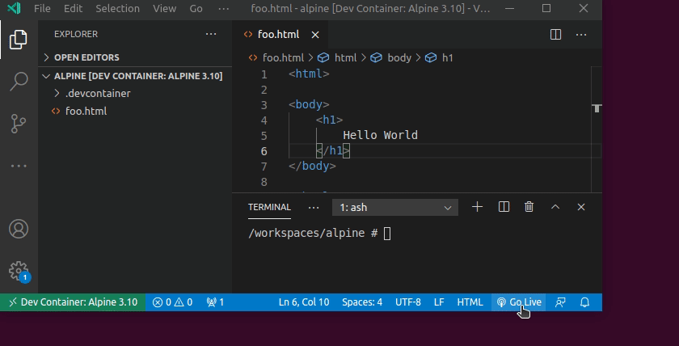

# November 2020 (version 1.52)

## Visual Studio Code Remote Core

### Open in browser from remote

The `BROWSER` environment variable is used in UNIX to allow programs to open a browser on a given address.

We now set the `BROWSER` environment variable in the remote extension host to a command that opens the page locally, including the necessary forwarding of ports if the address is localhost.

You can try this out with the **Live Server** extension to develop a HTML page remotely:

### Extensions

We introduced a new command, **Extensions: Install Remote Extensions Locally...** to install all remote extensions locally.

### Port Forwarding

On linux remotes, ports are now forwarded automatically by detecting new processes that are listening on a port. This is an improvement over the old behavior (watching the terminal and debug output for strings that looked like addresses) because it will find more ports to forward.

When a forwarded port has a process listening on it, a substring of that process will now show in the Ports view.

### Server startup performance

In this milestone, we've introduced the following optimizations to improve startup performance of the server:

* Starting the server and installing extensions can now be done simultaneously. This will save time for installing extensions, as they will be installed in the background while the server is being started.

## Containers (version 0.153.x)

### Support to select a branch when opening a repository in a container

When using the **Remote: Clone Repository in Container Volume...** command to clone a repository from GitHub, then you can now also select the branch that should be cloned into the volume.

### VS Code server and extension cache on Docker volume

We now create a `vscode` Docker volume on which we install the VS Code server and cache extensions for shorter creation and rebuild times of Dev Containers. Additionally, extensions configured in the `devcontainer.json` and user settings are now installed while the VS Code server starts up - their installation no longer blocks the startup process.
